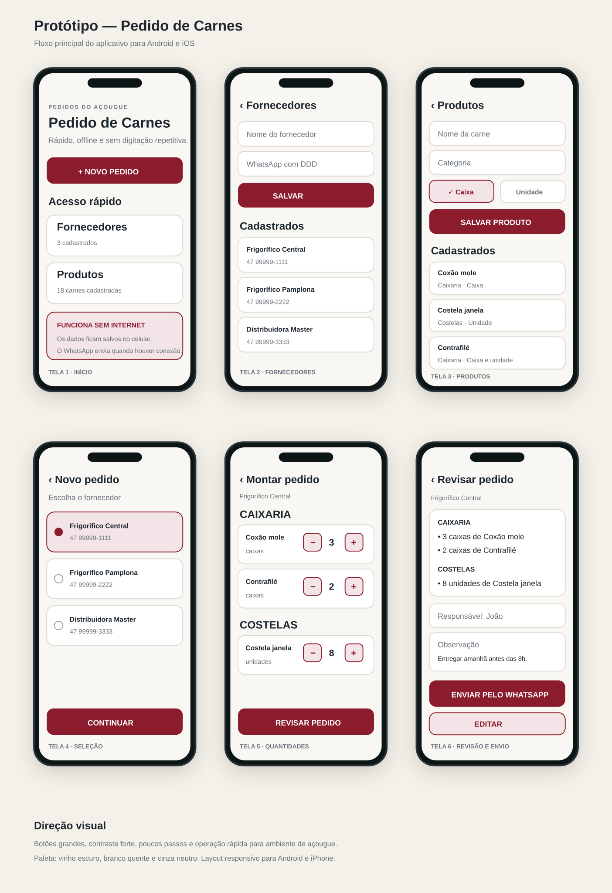

# Protótipo visual — Pedido de Carnes

Este arquivo mostra o fluxo planejado do aplicativo antes da geração do APK e da versão para iOS.

## Fluxo completo

## Etapas do usuário

1. Abrir o aplicativo.
2. Tocar em **Novo pedido**.
3. Selecionar o fornecedor.
4. Escolher carnes e quantidades por caixa ou unidade.
5. Revisar responsável e observação.
6. Abrir o WhatsApp com a mensagem pronta.

## Direção de UX/UI

- Botões grandes para uso rápido no ambiente de trabalho.
- Poucos passos até o envio.
- Contraste forte e leitura fácil.
- Funcionamento offline até o momento do envio.
- Mesma experiência planejada para Android e iPhone.

> Este é um protótipo visual. Os cadastros e o fluxo funcional estão sendo implementados no aplicativo React Native.